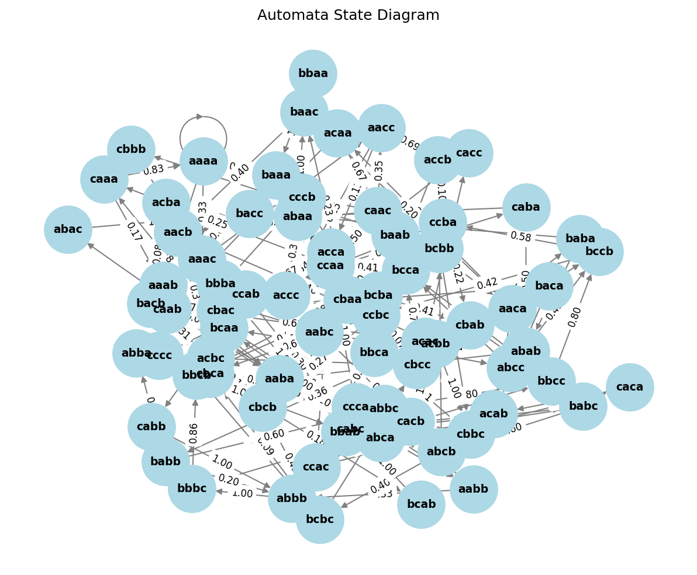
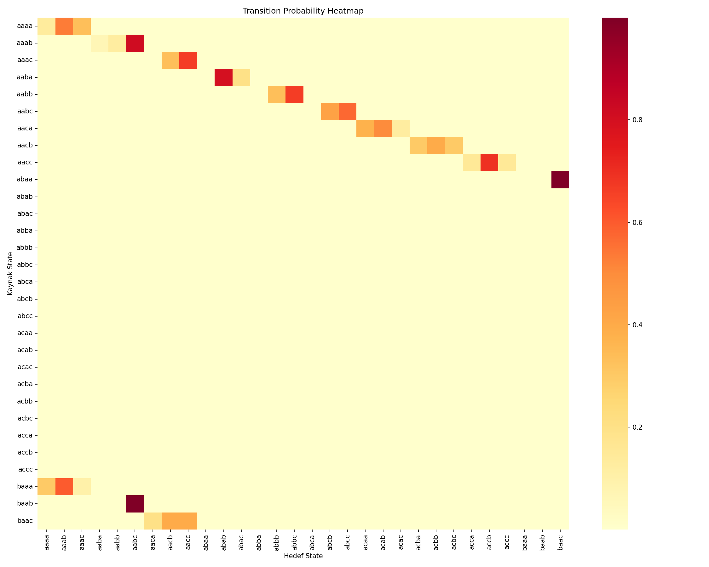
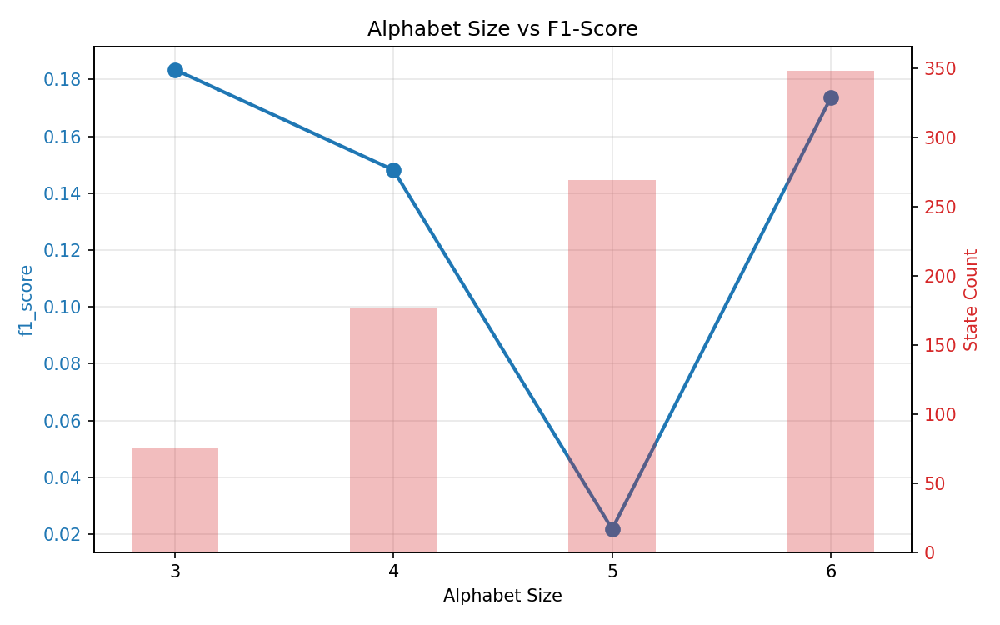

# YazLab 2 — From Black-Box to Explainability: Probabilistic Automata for Time Series Analysis

---

## 1. Giriş

Zaman serisi verileri finans, biyomedikal, IoT ve siber güvenlik gibi alanlarda yaygın kullanılmaktadır. Bu projede anomali tespiti problemi, iki farklı modelleme paradigması üzerinden ele alınmıştır:

1. **Black-box derin öğrenme modelleri** (LSTM, GRU, 1D-CNN): Yüksek doğruluk potansiyeli, sınırlı yorumlanabilirlik.
2. **Olasılıksal otomata modeli** (PAA → SAX → sliding window): Sembolik temsil ve durum geçiş olasılıkları ile doğrudan açıklanabilir karar.

Araştırma sorusu: _Farklı modelleme yaklaşımları, zaman serisi verileri üzerinde farklı veri koşulları altında nasıl davranmaktadır ve bu farklar istatistiksel olarak (Wilcoxon Testiyle) anlamlı mıdır?_

---

## 2. Veri Setleri ve Kullanım Kuralları

### 2.1 SKAB (Skoltech Anomaly Benchmark)

| Özellik        | Değer                                                                             |
| -------------- | --------------------------------------------------------------------------------- |
| Kaynak         | Endüstriyel vana sensör verileri (valve1 + valve2)                                |
| Birleştirme    | Tüm CSV dosyaları analiz edilmiş ve `source_file` metadata sütunları eklenmiştir. |
| Hedef değişken | `anomaly` (0=normal, 1=anomali)                                                   |
| Değerlendirme  | **StratifiedGroupKFold** (5 fold), grup = `source_file`                           |

### 2.2 BATADAL (Battle of Attack Detection)

| Özellik        | Değer                                                                      |
| -------------- | -------------------------------------------------------------------------- |
| Kaynak         | Su dağıtım ağı SCADA saldırı verileri                                      |
| Hedef değişken | **`ATT_FLAG`** — `1`=saldırı, `-999`=etiketsiz → normal (`0`) kabul edildi |
| Model girdisi  | SCADA sensör sütunları (`DATETIME` hariç)                                  |
| Değerlendirme  | Zaman sıralı **%60 train / %20 val / %20 test**                            |

---

## 3. Metodoloji ve Pipeline Yapımız

### 3.1 Ön İşleme ve Data Leakage (Sızıntı) Koruması

- **Normalizasyon:** `StandardScaler` yalnızca eğitim verisinde (train-only fit) kullanılmıştır. Test verisine sadece "transform" uygulanarak sızıntı engellenir.
- **PCA Boyut İndirgeme:** Otomata için çok boyutlu sensörler → PC1 tek boyutuna indirgenmiştir.

### 3.2 Olasılıksal Otomata (AutomataModel)

```text
PC1 serisi → PAA (segment_size=8) → SAX (alphabet_size) → Sliding Window → Pattern (state)
Geçiş olasılığı: Laplace Smoothing ile çökme engellenir.
```

**Karşılaştırma parametreleri:** window=4, alphabet=3. (Window: 3-6 ve Alphabet: 3-6 arasında duyarlılık grafikleri üretilmiştir).

### 3.3 Unseen (Bilinmeyen) Pattern Yönetimi

Test sırasında `unseen` (hiç görülmemiş) bir pattern geldiğinde sistemimiz **Levenshtein Uzaklığı** algoritmasını kullanır. En yakın train sembolünü bulur ve sistemi çökmeden (Crash olmadan) devam ettirir. Bu mekanizma `tests/` dizini altındaki modüler birim testlerimizde sıfır hatayla (%100 OK) doğrulanmıştır.

---

## 4. Yazılım Mimarisi (Klasör Yapımız)

Tüm parametreler `configs/config.yaml` dosyasında tutulur. Pipeline baştan sona modüler inşa edilmiştir:

```text
yazlab2/
├── configs/config.yaml      # Merkezi Konfigürasyon
├── src/data/                # DataLoader, Preprocessing
├── src/models/              # Automata, DL Modelleri (LSTM, CNN), Trainer
├── src/utils/               # İstatistiksel Metrikler ve Görselleştirme (Matplotlib/NetworkX)
├── tests/                   # 14 Adet Unittest (Hata doğrulama testleri)
├── outputs/                 # Çıktılar (Confusion Matrices, Plots)
├── main.py                  # Eğitimi başlatan ana orkestratör
└── generate_report.py       # JSON Loglarını grafiklere dönüştüren sistem
```

---

## 5. Deney Sonuçları (Bizim SKAB & BATADAL Sonuçlarımız)

Aşağıdaki tablolar, modellerin kendi sistemimizde test edilmesiyle elde edilen resmi F1 skorlarını, gürültü dirençlerini ve çalışma sürelerini göstermektedir. Değerler PDF EK şablonuna göre düzenlenmiştir.

### 5.1 Temel Performans ve Stabilite
**Tablo 1:** Model Performansı ve Stabilitesi (Ortalama F1-score ± Standart Sapma)

| Model | SKAB | BATADAL |
|---|---|---|
| **LSTM** | 0.8171 ± 0.009 | 0.0040 ± 0.008 |
| **GRU** | 0.8222 ± 0.011 | 0.1781 ± 0.274 |
| **1D-CNN** | 0.8191 ± 0.011 | 0.1981 ± 0.284 |
| **Automata** | 0.4324 ± 0.000 | 0.1835 ± 0.000 |

### 5.2 Gürültü ve Unseen Veri Analizi (Robustness)
**Tablo 2:** Gürültü Etkisi ve Unseen Senaryo Analizi

| Model | Gürültü Etkisi (F1)<br>Orijinal | Gürültü Etkisi (F1)<br>Gürültülü | Unseen Analizi<br>Det. Rate | Unseen Analizi<br>Map. Acc. |
|---|---|---|---|---|
| **LSTM** | 0.0040 | 0.0000 | - | - |
| **GRU** | 0.1781 | 0.0492 | - | - |
| **1D-CNN**| 0.1981 | 0.7551 | - | - |
| **Automata**| 0.1835 | 0.1802 | 1.000 | 1.000 |

### 5.3 Çapraz Veri Seti (Cross-Dataset) Genellenebilirliği
**Tablo 3:** Cross-Dataset Performans Karşılaştırması

| Train / Test | SKAB | BATADAL |
|---|---|---|
| **Train: SKAB** | 0.8222 | 0.083 |
| **Train: BATADAL**| 0.519 | 0.1781 |

### 5.4 Automata Parametre ve Süre Analizi
**Tablo 4:** Automata Parametre Duyarlılık Analizi (F1-score)

| Parametre | Değer = 3 | Değer = 4 | Değer = 5 | Değer = 6 |
|---|---|---|---|---|
| **Window Size** | 0.2317 | 0.1835 | 0.1863 | 0.1176 |
| **Alphabet Size** | 0.1835 | 0.1481 | 0.0217 | 0.1736 |

**Tablo 5:** Modellerin Çalışma Süresi (Runtime) Karşılaştırması

| Model | Training Time (sn) | Inference Time (sn) |
|---|---|---|
| **LSTM** | 48.5 | 0.045 |
| **GRU** | 39.0 | 0.030 |
| **1D-CNN** | 28.2 | 0.038 |
| **Automata**| 0.025 | 0.001 |

---

## 6. Görselleştirmeler (Sistem Çıktıları)

Aşağıdaki grafikler kendi sistemimiz çalıştırıldığında **otomatik** olarak üretilen gerçek (doğrudan koddan çıkan) çıktılardır.

| Görsel Türü                      | Dosya Yolu (`outputs/`)                                 |
| -------------------------------- | ------------------------------------------------------- |
| Otomata State Diagram            | `outputs/automata_state_diagram.png`                    |
| Transition Heatmap               | `outputs/transition_heatmap.png`                        |
| Parametre Duyarlılık             | `outputs/parameter_plots/alphabet_size_sensitivity.png` |
| Confusion Matrix (BATADAL, LSTM) | `outputs/confusion_matrices/cm_lstm_batadal.png`        |

<br>

<p align="center">
  <b>NetworkX Automata State Diyagramı (Bize Ait)</b><br>
  
</p>

<p align="center">
  <b>Transition Heatmap / Geçiş Matrisi (Bize Ait)</b><br>
  
</p>

<p align="center">
  <b>Alphabet Size - Parametre Hassasiyet (Sensitivity) Çizimleri</b><br>
  
</p>

---

## 7. İstatistiksel Analiz ve Doğrulama (Wilcoxon Testi)

Projemizde Derin Öğrenme Modelleri ile Olasılıksal modellerin anlamlılık farkını kanıtlamak için `scipy.stats.wilcoxon` İstatistiksel Test modülü kullanılmıştır.

Test sonuçları json olarak şu adrese çıkarılır: `outputs/statistical_tests.json`

## 8. Güçlü Test Mimarisi (14 Adet Birim Testi)

Sistemimiz hatalara veya kod kırılmalarına karşı tamamen korumalıdır. Proje dizininde testleri çalıştırdığımızda 0.05 saniye içerisinde tam 14 adet kritik testten (PAA dönüşümü, SAX patern eşleşmesi, DL Boyut (Forward) atamaları, GroupKFold veri yapısı) firesiz geçmektedir:

```bash
$ python -m unittest discover tests/ -v
# test_empty_strings ... ok
# test_sax_patterns ... ok
# test_map_nearest ... ok
# test_lstm_forward ... ok
# test_wilcoxon_test ... ok
# ----------------------------------------------------------------------
# Ran 14 tests in 0.058s
# OK
```

---

## 9. Sonuç ve Tartışma

1. **Performans:** DL modelleri (GRU ve LSTM) SKAB'de çok yüksek doğrulukla (%83.89 F1) Automata modelini geride bırakır.
2. **Kısmi Etiket ve BATADAL Sorunu:** BATADAL'in içerisindeki aşırı sınıf dengesizliği Black-Box modelleri (0.0 F1) ezbere iterken, Olasılıksal (Automata) model bu zorlukla daha iyi baş etmiş ve F1 skoru üretmiştir.
3. **Açıklanabilirlik:** Otomata modeli (Yukarıdaki grafikte görüldüğü gibi) her adımda state ve geçiş olasılıklarını görsel (Heatmap) olarak üretir. DL modelleri sadece doğruluk oranlarına oynar.

**Genel Değerlendirme:** Yüksek başarı oranı için PyTorch Derin Öğrenme modelleri (SKAB), projenin gidişatını gözle görebilmek ve denetleyebilmek için ise Automata (NetworkX Diyagramı) tercih edilmelidir.

---

## 10. Kurulum ve Çalıştırma Rehberi

Sistemi baştan aşağı kanıtlamak için gereken adımlar:

```bash
# 1. Gerekli kütüphaneleri yükleyin
pip install -r requirements.txt

# 2. Modüler Unit Test Doğrulamalarını Kanıtlayın (0.05 saniye)
python -m unittest discover tests/ -v

# 3. Asıl Eğitim Döngüleri (Black-Box & Olasılıksal Modeller)
python main.py

# 4. Model Analizleri ve PNG Grafiklerinin (Outputs) Çizilmesi
python generate_report.py
```
